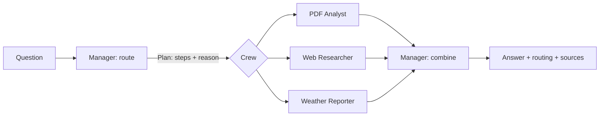

# Agentic RAG with CrewAI

A multi-agent question-answering system built with [CrewAI](https://docs.crewai.com). A Manager agent reads each question, decides which specialist should answer it, and combines their answers when a question has more than one part.

**Author:** Rudresh Narwal

## Agents

| Agent | Job | Tool |
|---|---|---|
| Manager | Chooses the specialists for a question and combines their answers | none |
| PDF Analyst | Answers from the uploaded PDF, citing page numbers | `Search PDF` (Chroma vector search) |
| Web Researcher | Answers general and current questions, with source links | `Web Search` (DuckDuckGo) |
| Weather Reporter | Reports temperature, humidity, wind speed and condition for a city | `Get Weather` (OpenWeather API) |

## How a question is answered



1. **Route.** The Manager returns a structured `Plan` (a Pydantic model): a list of steps, each naming one specialist and a sub-question, plus a one-line reason.
2. **Run.** A CrewAI `Crew` is built with one `Task` per step, so only the chosen specialists run.
3. **Combine.** If more than one specialist ran, the Manager gets a final task with their outputs as context and writes one answer.
4. **Show.** The UI displays which agents were chosen and why, the answer, and the sources.

Sources (PDF page numbers, web links) are recorded by the tools themselves when they run, so they are what was actually retrieved rather than what the model remembers.

### Design choice: planned routing instead of `Process.hierarchical`

CrewAI's hierarchical process lets a manager delegate while it works, but the choice it makes is hard to see and cannot be tested. Here the Manager commits to a plan first, and plain Python runs it. The cost is that the Manager cannot change its mind halfway through. The benefit is that the routing decision is shown to the user and checked by a labelled question set in `test_assistant.py`.

## PDF pipeline

`rag.py`: extract text per page (pdfplumber) → split each page into 800-character chunks with 100 characters of overlap, each tagged with its page number → embed and store in an in-memory Chroma collection (default `all-MiniLM-L6-v2` embeddings) → return the top 4 chunks for a query.

Each upload gets its own collection, so two people using the app at once never see each other's documents.

## Setup

Needs Python 3.10 to 3.13.

```bash
python3.12 -m venv .venv
source .venv/bin/activate
pip install -r requirements.txt
cp .env.example .env        # then add your two keys
streamlit run app.py
```

Keys (both have free tiers):

- `OPENROUTER_API_KEY` from <https://openrouter.ai/keys>. The model is `openai/gpt-4o-mini`, set in `assistant.py`.
- `OPENWEATHER_API_KEY` from <https://home.openweathermap.org/api_keys>. A new key can take a little while to start working.

The first PDF upload downloads the embedding model (about 80 MB) once.

## Try it

- `What's the weather in Delhi?` → Weather Reporter
- `What is the latest news on CrewAI?` → Web Researcher
- Upload a PDF, then `What does the document conclude?` → PDF Analyst
- `Summarise my PDF and tell me the weather in Mumbai` → PDF Analyst + Weather Reporter, combined by the Manager

## Checks

```bash
python test_assistant.py
```

- Chunking keeps page numbers, overlaps correctly and loses no text.
- Retrieval returns the right page for a query.
- Routing: eight labelled questions, two of them compound, must each go to the expected specialists. This one calls the LLM, so it only runs when `OPENROUTER_API_KEY` is set.

## Files

| File | Contents |
|---|---|
| `assistant.py` | LLM setup, the `Plan` model, the three tools, the four agents, `route()` and `answer()` |
| `rag.py` | PDF reading, chunking, indexing and search |
| `app.py` | Streamlit interface |
| `test_assistant.py` | The checks above |

## Limits

- Each question is answered on its own; there is no memory of earlier turns.
- One PDF at a time. Scanned PDFs have no extractable text and are rejected.
- DuckDuckGo search needs no key but can be rate-limited.
